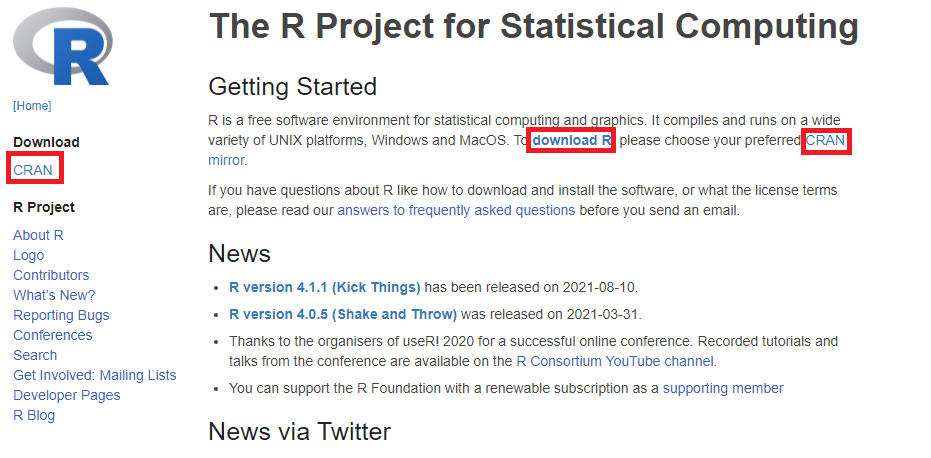
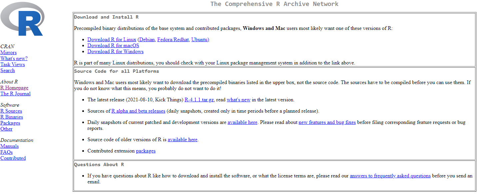
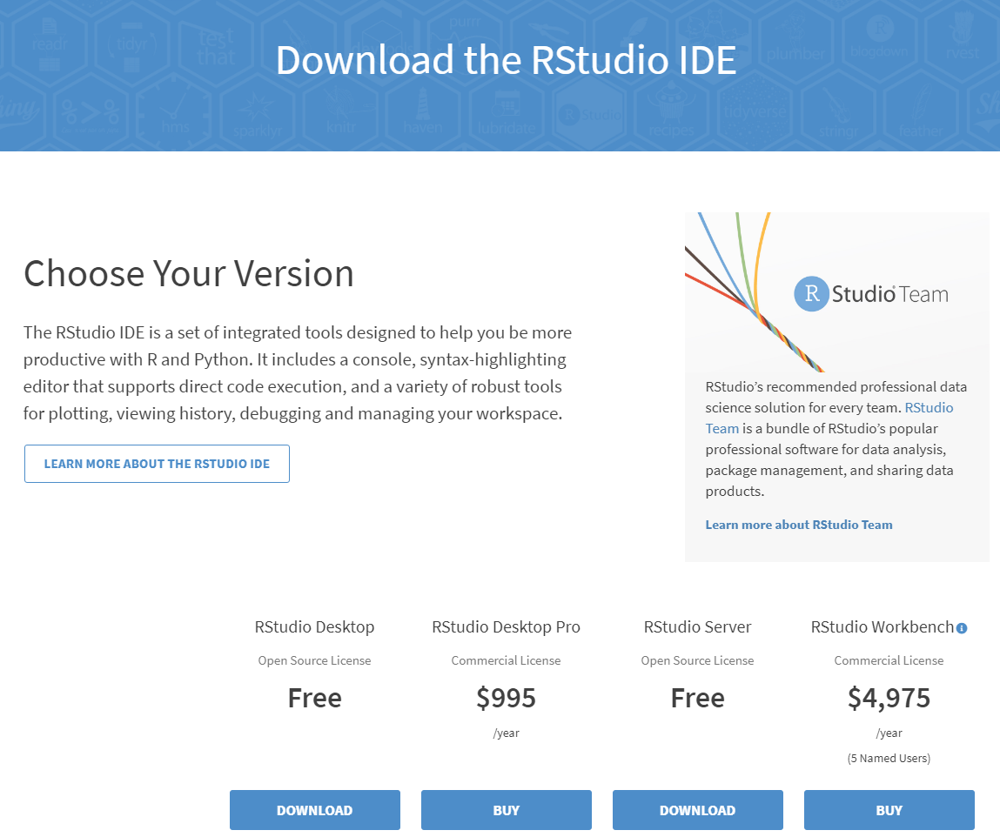

```{r setup, include=FALSE}
knitr::opts_chunk$set(echo = TRUE)
```

## Downloading R

The first thing we need to do is download R, a free statistical programming language. R will be used heavily to perform phylogenetic analyses and visualize data. You can download R [here](https://www.r-project.org/). As of writing this, R is on version 4.1.1 (Kick Things), we will go over how to download that version. If you already have R installed you may want to consider updating R, directions on this below.

----

### Finding the archive for downloading and selecting the correct type for your operating system  {.tabset .tabset-fade .tabset-pills}

The link should take you to the R homepage. The first thing you'll want to do is click the link titled **Download R**, or any of the links in red boxes as they'll all take you to the same place.




From here you'll be taken to a page that has a list of archives that you can download R from. I would recommend choosing an archive that is close to you, there is even one at ISU! After selecting a mirror, you will be taken to this page:


You will want to click the appropriate link for your operating system. I am on a Windows machine so I would click the third link. Although the process is largely the same across operating systems, there will be separate instructions for Windows and Mac.


#### Windows

After clicking the link, I was brought to a subdirectory, on this page you should find a link titled **install R for the first time**, click that. You will then be brought to a page with a download link, that link will download an R installer titled `R-4.1.1-win.exe.` Loading the installer should bring up a prompt with the preferred language, followed by a preamble about the liscence, and an installation location. I would recommend leaving the installation location as the default. In fact, you should be able to click `Next >` thru all the instructions, leaving most of them with their default options. 

#### Mac

When you install for macOS, you simply need to choose the latest release and download the correct installation package for your version of macOS. After downloading the file, open the `.pkg` file and follow the instructions for installing R on your computer. 


### {-}

----

### Updating R


-----

Congrats! An up to date version of R should be installed! You should now have an R executable. If you run R you should be greeted with the message:
```
R version 4.1.1 (2020-08-03) -- "Kicking Things"
Copyright (C) 2020 The R Foundation for Statistical Computing
Platform: x86_64-w64-mingw32/x64 (64-bit)
```
Depending on the operating system you may see different things for the `Platform:` portion. With R installed you could run through all of the tutorials for this course. However, running from the console isn't the prettiest or easiest environment and for this reason you should also download Rstudio.

## Downloading Rstudio

You can find Rstudio [here](https://www.rstudio.com/products/rstudio/download/). 




The free desktop version should be sufficient for our purposes. After clicking the download link for the free version, you will again be prompted to select the correct type for your operating system. Doing so will download an installer. You shouldn't need to change any of the default options on installation but you may want to consider adding a desktop shortcut for easy access. 

## Using Rstudio

Rstudio provides a powerful working environment for R. It can seem a bit overwhelming at first but once you get the hang of it, there's a lot you can do with Rstudio. First, lets go over the different panes that appear.


## Downloading and updating R packages

Througout this course you will need to download and install packages needed to complete the tutorials. You can easily browse the available packages using the Rstudio installer. This can be found in the "Packages" panel. 

Additionally, you can install pacakges in the R terminal. For example, you can install the phylogenetics pacakage `ape` using the command `install.packages("ape")`. Each tutorial will indicate the required packages. 